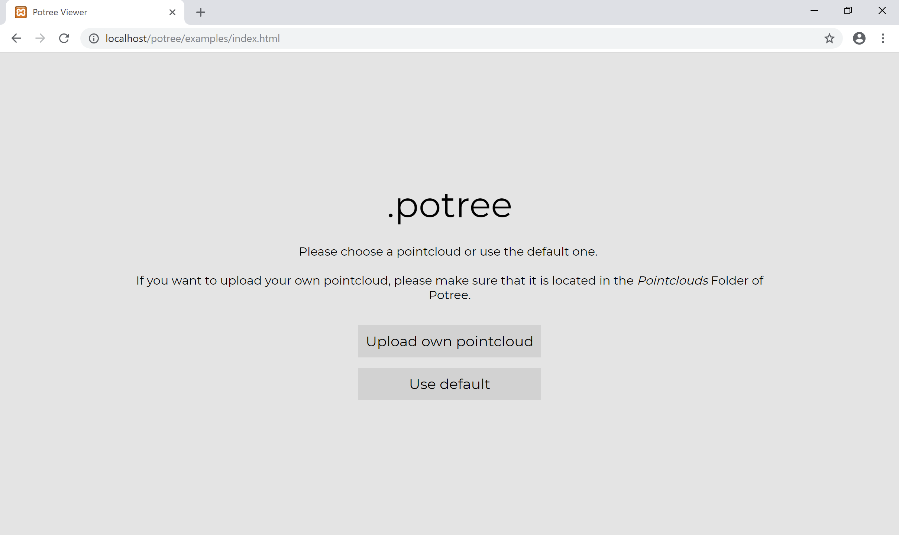
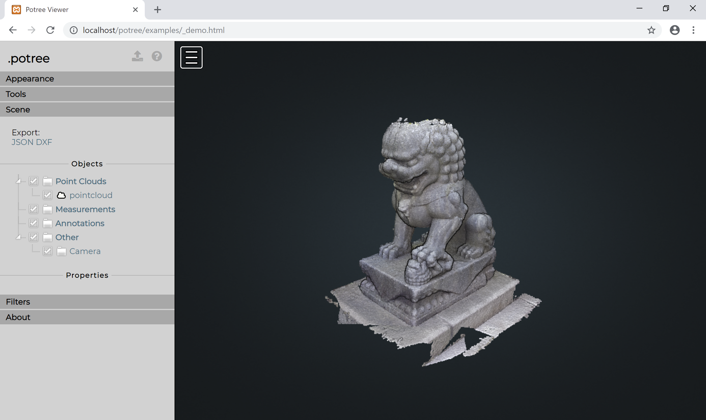

# Annotation Tool - Potree Extension

## Set Up

#### Install Prerequisites
1. Install node.js & npm
1. Install [XAMPP](https://www.apachefriends.org/index.html) & set it up
1. Clone repository or download .zip-File to */xampp/htdocs*
1. Navigate to the *Potree* directory
1. Run the following commands to install gulp
```
npm install --save
npm install -g gulp
npm install -g rollup
```

#### Run the program

1. Open Xampp and run the Apache Server and MySQL

1. Go to http://localhost/potree/examples/index.html

1. Choose to upload your own point cloud or use the default one
1. The Set Up was successful if you see this page:


#### Upload Your Own Point Cloud

On the Start Page of Potree you may choose to upload your own point cloud.

To do that, make sure to copy your point cloud folder (in .potree format) to ```/potree/pointclouds/```

## How to Use the Annotation Tool

The annotation tool allows the user to use different volume measurements to segregate the point cloud into smaller units.

#### Toolbar

There are currently two working volume measurements available: **Box Volumes** and **Sphere Volumes**. In the future, Height Profile and Polygonal Volume may be added.


Furthermore the toolbar offers the user the possibilities to save all current selections to the database; delete all current selections both from Potree as well as the database; and the visibility tool, that can hide or show all saved selections.

#### Infobar

The infobar opens up if the users adds a new selection or clicks on a selection volume from the scene.

It gives more detailed information about the current box, such as type, id, position, dimension and rotation:
 

Moreover, it gives the user the chance to define properties for this selection, such as the material. These properties are saved in the database once the selection was saved; either by clicking *Save Volume* in the infobar or *Save All Selections* in the toolbar.

Lastly, the infobar provides the user with the ability to retrieve all point cloud points within the chosen selection box and download them either as .las or .csv files.


## Database

In order to save the selections and their properties, the potree extension uses a MySql Database, also hosted on the local machine: ```http://localhost/phpmyadmin/```

If needed, the user can change the database properties in ```/potree/database/connection.php ```

It is necessary to define the server, username, password (if applicable) and database name.

```some code```

The database consists of three tables:
* box
* materials
* points

** 1. Box Table: **
The box table is used to store all selections.


** 2. Materials Table: **
The material table allows the user to reference materials in the box table with an ID; and specifies the properties of the material.


** 3. Points Table: **
The points table saves individual points with their position and additional properties.


